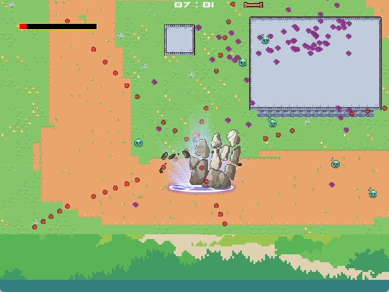

# kz_survivor



kz_survivor is a Cool survivor-like Game written in Java Libgdx.

## how to run it?
the most simple way to run this project on your own PC through the source code is :
``lwjgl3:run``

this command will build the gradle and run the windows game.
## how to build it?
you can build the project by running the following command:
```
./gradlew build
```

## about the project
this is a game which designed and developed by myself. I like coding, I like Game. Then I though, why not make a game by myself? So I started this project.
I hope you like it. If you have any question, please feel free to contact me.
### Why is Java?
Maybe you have the question: why do you make a game in Java? there are lots of other Game Dev Engine and languages, such as Unity, Unreal Engine, C++, C#, Python, etc. Why do you choose Java?
I choose Java because I am familiar with it, and I think it is a good language for game development.
And thanks for LIBGDX, it is a great game development framework for Java. It provides a lot of features and tools to make game development easier and more efficient.
In my own opinion, Java could be a good programming language for game development, especially for 2D games. With the help of libraries like LibGDX, developers can create games that are not only functional but also visually appealing and engaging.
